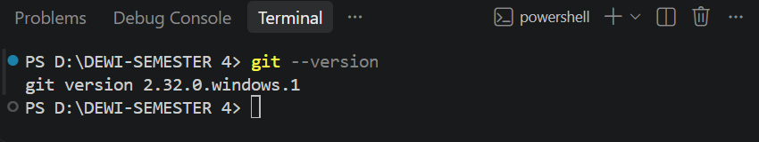
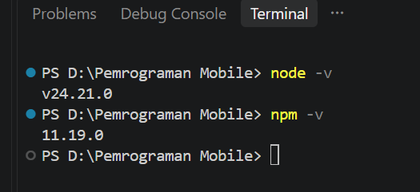
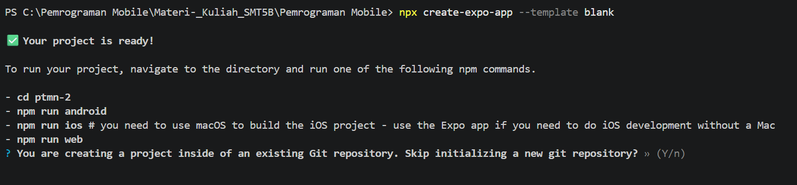
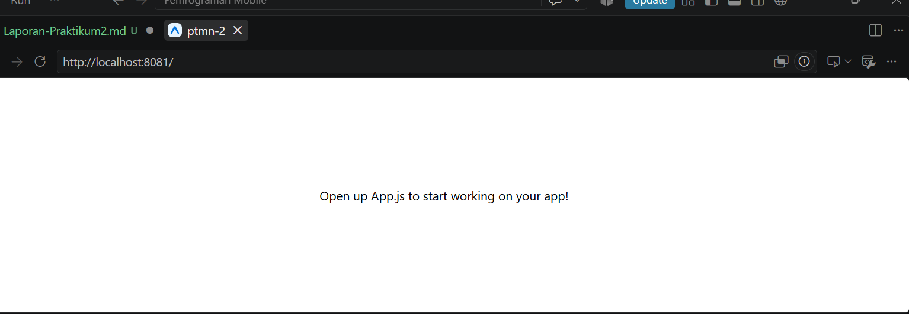

# Praktikum Menyiapkan Lingkungan Pengembangan dan Memulai Pemrograman Mobile (react Native) #

## Tujuan Pembelajaran ##
Mahasiswa mampu:
1. Menyiapkan lingkungan pengembangan dan memulai pemrograman mobile (React Native)
2. Membuat aplikasi mobile dengan React Native
3. Menyelesaikan Tugas CV sederhana dengan React Native

## Materi dan Laporan Praktikum ##
1. Menyiapkan lingkungan pengembangan dan memulai pemrograman mobile (React Native)
- Memastikan instalaso Git bash
- Cek Instalasi Git bash (git --version)
- Bukti Verifikasi

- Memastikan adanya Node.JS dan NPM
  - Download dan Install Node.JS di https://node.js.org/en/download/
  - Konfirmasi Node.JS dan NPM (node -v, npm -v)
  

2. Membuat aplikasi / Projek baru dengan React Native Framework Expo Go
- Buka dan baca dokumentasi resmi link https://docs.expo.dev/
- Buka dan baca dokumentasi resmi link https://reactnative.dev/docs/getting-started
- Memulai Membuat projek baru
- Open terminal change directory ke Pertemuan-2
- Masukan perintah (npx create-expo-app --template blank)
- Bukti verifikasi

- Running Projek
 - Cd ke ptmn2
 - npx expo start
 - Install Expo Go di Android atau IOS
 - Bisa juga menggunakan Web emulator di Laptop / PC
 - Setelah berhentikan (ctrl + C)
 - Install (npx expo install react-dom react-native-web)
 - npx expo start --web
 - Konfirmasi Keberhasilan
 

 Tugas Praktikum
   - Membuat aplikasi CV sederhana dengan React Native
   - Nama Lengkap
   - NIM
   - Asal Sekolah
   - Cita-cita
   - Rencana Menggapai cita-cita