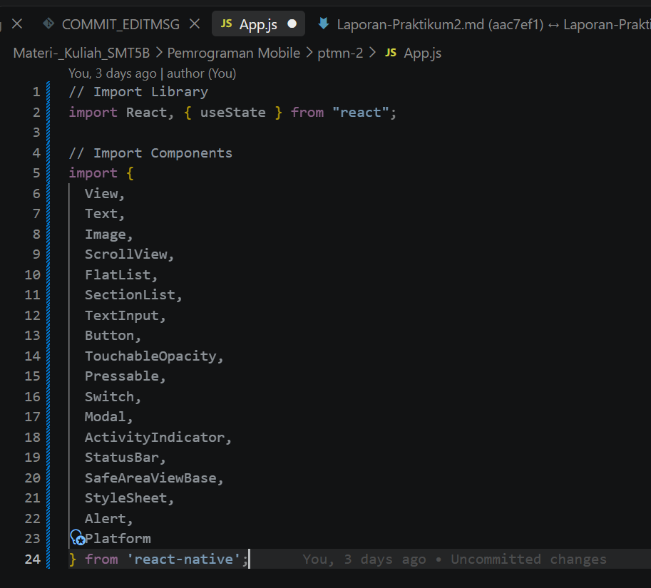
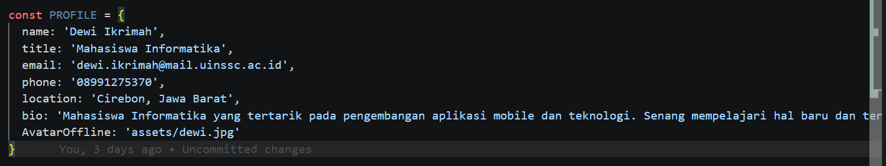
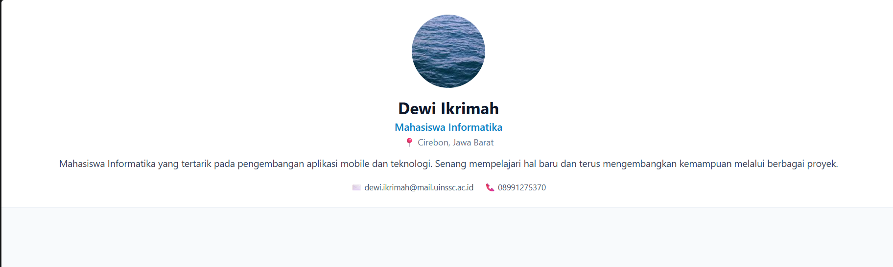
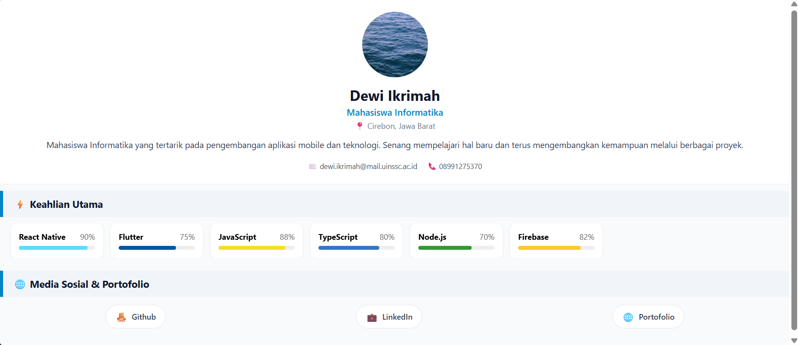
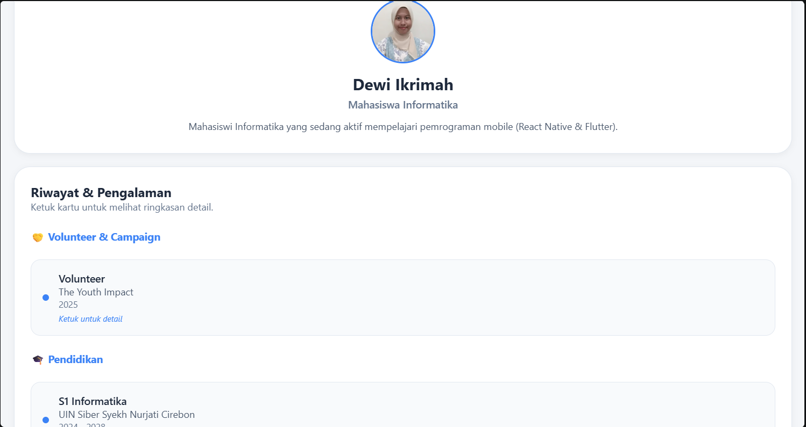
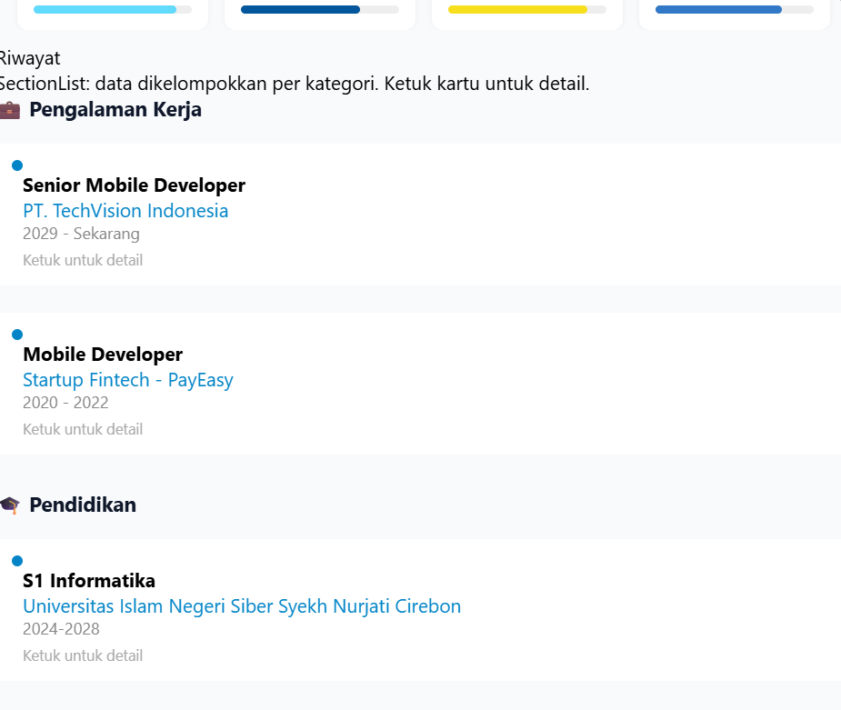
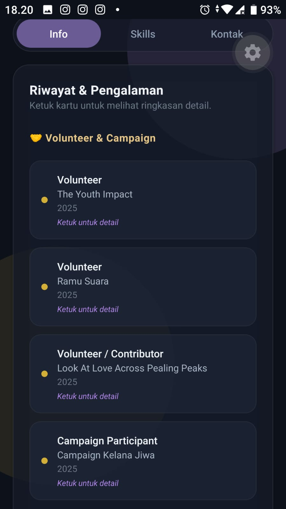
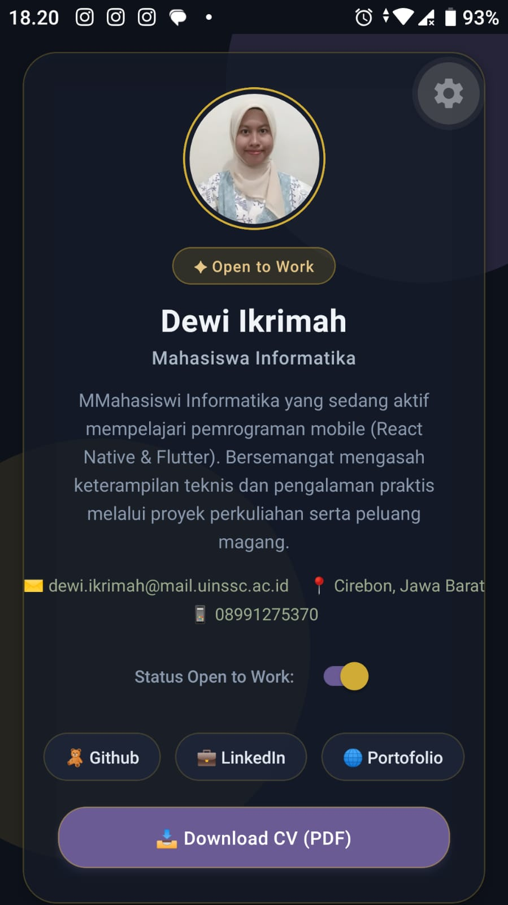

# Laporan Praktikum 3: Core Components dan Styling #

### Langkah 1: Import Library & Components ###

'''
1. Buka File App.js yang ada di folder projek ptmn2
2. Import Library dan Component yang diperlukan 
3. Konfirmasi Bukti

'''

### Langkah 2: Merubah Tampilan App.js ###

'''
1. Buat Objek Array bernama PROFILE
2. Masukkan data yang diperlukan
3. Konfirmasi Bukti

'''

## Langkah 3: Membuat Sub-Components (SkillCard & TimelineCard) ##

'''
1. Membuat sub-component SkillCard untuk menampilkan satu item skill.
2. Membuat sub-component TimelineCard untuk menampilkan satu item pada riwayat.
3. Menempatkan kode SkillCard dan TimelineCard di antara data dan fungsi App().
4. Menggunakan sub-component agar komponen yang sama dapat digunakan kembali untuk menampilkan beberapa item.
5. Konfirmasi Bukti

'''

## Langkah 4: Membuat Sub-Component Header CV ##

'''
1. Membuat sub-component ProfileHeader untuk menampilkan informasi profil utama pengguna (avatar, nama, profesi, lokasi, bio, dan kontak).
2. Menyusun elemen layout header menggunakan komponen React Native seperti Image, Text, dan View.
3. Menempatkan kode ProfileHeader di antara bagian Sub-Components lain dan sebelum fungsi App().
4. Mengirimkan data profil dari objek PROFILE ke dalam ProfileHeader melalui props untuk menampilkan data secara dinamis.
5. Konfirmasi Bukti

'''

## Langkah 5: Membuat Section Header & Mengintegrasikan Data List ##

'''
1. Membuat sub-component SectionHeader untuk menampilkan judul pembatas pada setiap kategori/section CV (seperti Keahlian dan Media Sosial).
2. Mengintegrasikan FlatList horizontal untuk merender daftar SKILLS menggunakan SkillCard.
3. Merender daftar SOCIAL berbentuk tombol/chip interaktif menggunakan TouchableOpacity.
4. Menyusun seluruh komponen (ProfileHeader, SectionHeader, FlatList, SOCIAL) di dalam App().
5. Konfirmasi Bukti

'''

## Langkah 6: Mengimplementasikan SectionList & Modal Detail ##

'''
1. Mengintegrasikan SectionList untuk merender data kelompok SECTIONS (Pengalaman Kerja dan Pendidikan) menggunakan TimelineCard.
2. Membuat state selectedItem dan modalVisible dengan useState untuk menyimpan data item dan mengontrol status status pop-up.
3. Membuat komponen <Modal> interaktif untuk menampilkan deskripsi dan rincian lengkap ketika salah satu kartu pengalaman/pendidikan diketuk.
4. Konfirmasi Bukti

'''

## Langkah 7: FlatList (Daftar Skills) ##

'''
1. Menambahkan Flatlist di Dalam ScrollView
2. Konfirmasi Bukti

'''

## Langkah 8: Menambahkan SectionList (Pengalaman & Pendidikan) ##

'''
1. Menambahkan komponen <SectionList> untuk merender data kelompok SECTIONS (Pengalaman Kerja dan Pendidikan).
2. Mengkonfigurasi renderSectionHeader untuk menampilkan judul kategori dan renderItem menggunakan TimelineCard.
3. Menata tampilan daftar agar terstruktur rapi dengan indikator titik/timeline.
4. Konfirmasi Bukti

'''

### Langkah 9: Menambahkan Formulir Kontak (TextInput & Button) ###

'''
1. Menambahkan komponen `<TextInput>` untuk kolom input nama pengirim dan pesan teks interaktif.
2. Menggunakan state `senderName` dan `message` untuk menangkap input data yang diketik oleh pengguna.
3. Menambahkan tombol pengiriman pesan dengan komponen `<TouchableOpacity>` dan fungsi `handleSendMessage` untuk menampilkan alert konfirmasi.
4. Konfirmasi Bukti

'''

### Langkah 10: Menambahkan Tautan Eksternal & Aksi Interaktif ###

'''
1. Menggunakan API `Linking` dari React Native untuk mengintegrasikan tombol interaktif (seperti tombol GitHub atau unduh berkas).
2. Memastikan fungsi `handleOpenLink` dapat membuka URL eksternal dengan aman di peramban perangkat.
3. Konfirmasi Bukti

 

'''

### Langkah 11: Penyempurnaan Styling & Finishing Tema Putih Bersih ###

'''
1. Menyempurnakan objek `StyleSheet` dengan menerapkan tema warna putih bersih (*Clean White Theme* dengan aksen biru dan abu-abu terang).
2. Mengatur tata letak bayangan (*shadow*, *elevation*), radius sudut kartu (*borderRadius*), serta jarak spasi antar komponen agar tampilan CV mobile terlihat profesional dan rapi.
3. Memastikan seluruh komponen dari Langkah 1 sampai 11 terintegrasi dengan sempurna tanpa error.
4. Konfirmasi Bukti

 

'''

## LANGKAH 12 — Verifikasi & Pengujian ##

'''
Jalankan aplikasi dan pastikan semua fitur bekerja:

Yang Diuji	Hasil yang Diharapkan
1.	Aplikasi bisa dibuka => Layar CV tampil tanpa error
2.	Foto profil tampil	=> Gambar dari URL terload
3.	Halaman bisa di-scroll	=> Semua section bisa diakses
4.	Toggle Switch => Badge "Open to Work" muncul/hilang
5.	Progress bar skill => Bar berwarna sesuai persentase
6.	Ketuk kartu riwayat	=> Modal popup muncul dari bawah
7.	Tombol Tutup di Modal => Modal tertutup
8.	Isi form & kirim => Loading 2 detik → Alert sukses
9.	Kirim dengan input kosong => Alert peringatan muncul
10.	Tekan Download CV => Efek visual berubah + Alert
11.	Tap tombol sosmed => Alert URL muncul

'''